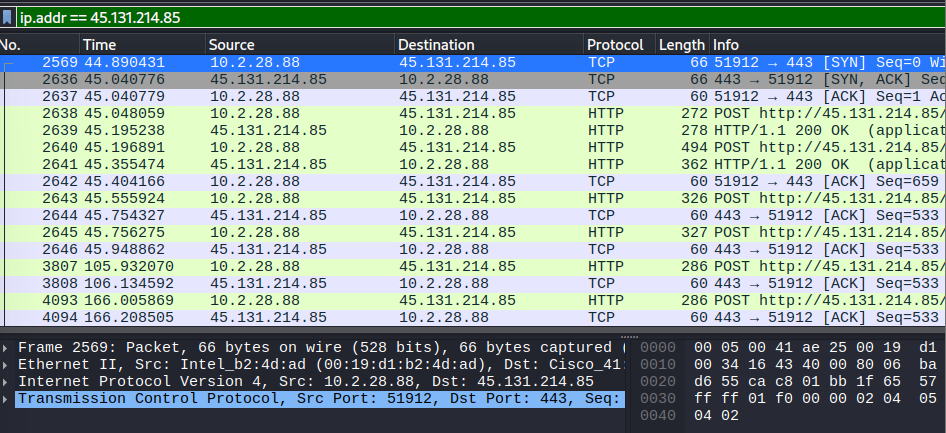
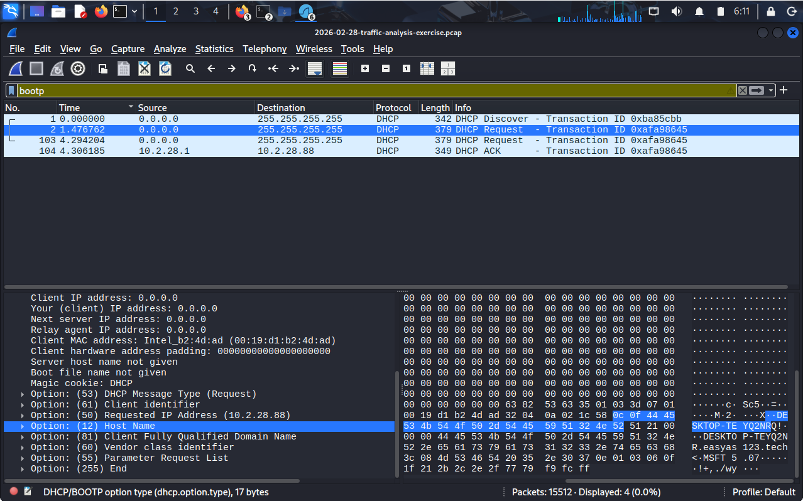
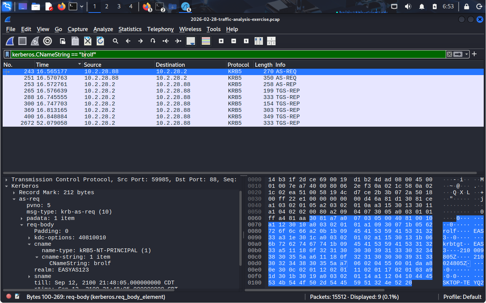
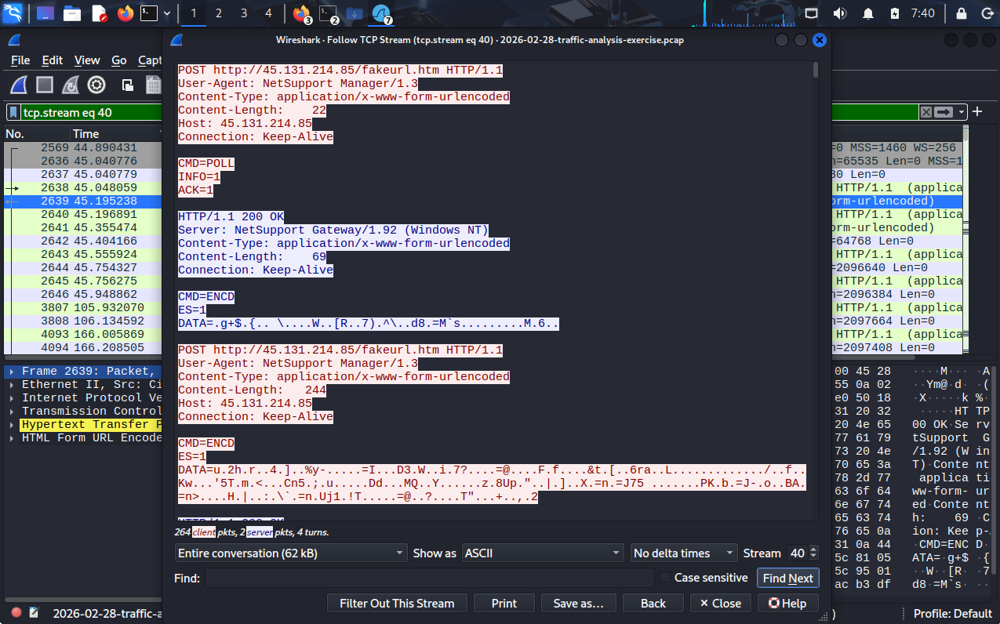
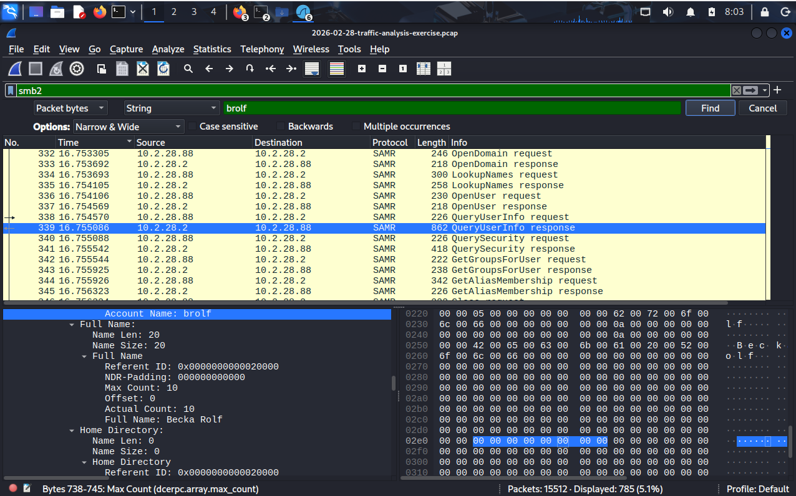

# Incident Report: NetSupport Manager RAT
**Date:** 2026-02-28  
**Severity:** High  
**Status:** Confirmed Compromise + Active AD Enumeration  
**Analyst:** Geekslam  
**Framework:** NIST SP 800-61 / MITRE ATT&CK  

---

## Summary
A Windows workstation on the EASYAS123 domain was found communicating 
with a known malicious external IP (45.131.214[.]85) associated with 
NetSupport Manager RAT. The infected host was identified via SIEM alert 
triage and confirmed through pcap analysis in Wireshark. Post-compromise 
activity included active AD enumeration via SAMR protocol, indicating 
the attacker was mapping domain accounts.

---

## Affected Host
| Field | Value |
|-------|-------|
| IP Address | 10.2.28.88 |
| MAC Address | 00:19:d1:b2:4d:ad |
| Hostname | DESKTOP-TEYQ2NRQ |
| Domain | EASYAS123 / easyas123.tech |
| Username | brolf |
| Full Name | Becka Rolf |

---

## Indicators of Compromise (IOCs)
| Type | Value |
|------|-------|
| C2 IP | 45.131.214[.]85 |
| C2 URL | http://45.131.214[.]85/fakeurl.htm |
| Port | TCP/443 (non-standard HTTP) |
| RAT | NetSupport Manager/1.3 |
| C2 Server | NetSupport Gateway/1.92 (Windows NT) |
| Beacon Commands | CMD=POLL, CMD=ENCD |

---

## MITRE ATT&CK Mapping
| Technique ID | Name | Evidence |
|---|---|---|
| T1219 | Remote Access Software | NetSupport Manager RAT confirmed |
| T1071.001 | C2 via Web Protocols | HTTP POST to C2 over port 443 |
| T1571 | Non-Standard Port | HTTP disguised on port 443 |
| T1087.002 | Account Discovery: Domain Account | SAMR enumeration of DC |

---

## Attack Timeline
| Time (UTC) | Event |
|---|---|
| 19:55:10 | DHCP lease assigned to DESKTOP-TEYQ2NRQ |
| 19:55:10 | First C2 beacon to 45.131.214[.]85 detected |
| 19:55:10 | Kerberos authentication to EASYAS123-DC |
| 19:55:10 | SAMR AD enumeration begins — accounts queried from DC |
| Ongoing | Periodic CMD=POLL beaconing and CMD=ENCD data exfil |

---

## Investigation Steps
### 1. C2 Traffic Identification
Applied Wireshark filter `ip.addr == 45.131.214.85`. Revealed internal 
host 10.2.28.88 sending HTTP POST requests to C2 on port 443.

**Finding:** Traffic used plain HTTP on port 443 (not HTTPS/TLS), 
a classic technique to bypass basic firewall rules.

### 2. Host Identification
Applied `bootp` filter. DHCP Request packet from 10.2.28.88 revealed:
- Hostname: DESKTOP-TEYQ2NRQ (Option 12)
- Confirmed IP assignment at 19:55:10 UTC

### 3. User Account Identification
Applied `kerberos.CNameString` filter. AS-REQ packet from infected 
host revealed authenticated user: **brolf**

### 4. Full Name Discovery
Applied `frame contains "brolf"` search in packet bytes. 
SAMR QueryUserInfo response (frame 339) from DC revealed:
- Account Name: brolf
- Full Name: **Becka Rolf**

**Bonus Finding:** SAMR traffic revealed attacker was actively 
enumerating AD accounts including LookupNames, OpenUser, 
QueryUserInfo, GetGroupsForUser — indicating domain reconnaissance.

### 5. RAT Communication Analysis
Followed TCP stream of POST requests to 45.131.214.85:
- User-Agent: NetSupport Manager/1.3
- Beaconing: CMD=POLL
- Data exfiltration: CMD=ENCD (encoded payloads)

---

## Recommended Actions
1. **IMMEDIATE:** Isolate DESKTOP-TEYQ2NRQ from network
2. Block 45.131.214[.]85 at perimeter firewall/proxy
3. Reset credentials for brolf (Becka Rolf)
4. Audit all accounts queried via SAMR from this host
5. Scan all endpoints for NetSupport Manager artifacts
6. Investigate initial infection vector (likely phishing)
7. Escalate to IR team — AD enumeration indicates active threat actor

---

## Screenshots

---

## Tools Used
- Wireshark (pcap analysis)
- Elastic SIEM (initial alert triage)

## References
- [MITRE ATT&CK T1219](https://attack.mitre.org/techniques/T1219/)
- [NetSupport Manager RAT - Unit42](https://unit42.paloaltonetworks.com)
- NIST SP 800-61 Rev 2 — Computer Security Incident Handling Guide

---

## RAT C2 Traffic Analysis

### C2 Communication Details
| Field | Value |
|-------|-------|
| C2 URL | http://45.131.214[.]85/fakeurl.htm |
| RAT User-Agent | NetSupport Manager/1.3 |
| C2 Server | NetSupport Gateway/1.92 (Windows NT) |
| C2 Beacon Commands | CMD=POLL, CMD=ENCD |

### What This Traffic Means
| Command | Purpose |
|---------|---------|
| `CMD=POLL` | Heartbeat beacon — RAT checking in with C2 server |
| `CMD=ENCD` | Encoded data transmission — exfiltrating system info |

### Key Observations
- RAT communicates via **plain HTTP on port 443** — not encrypted HTTPS
- This is deliberate: port 443 is normally allowed through firewalls for HTTPS
- The URL `/fakeurl.htm` does not exist — it is a decoy endpoint on the C2 server
- `NetSupport Gateway/1.92` in the server response confirms an active, 
  configured C2 infrastructure — not a test or accidental infection

### TCP Stream Evidence

*Figure: TCP stream showing NetSupport Manager RAT beaconing to 
45.131.214[.]85 with CMD=POLL heartbeat and CMD=ENCD encoded payload*

---